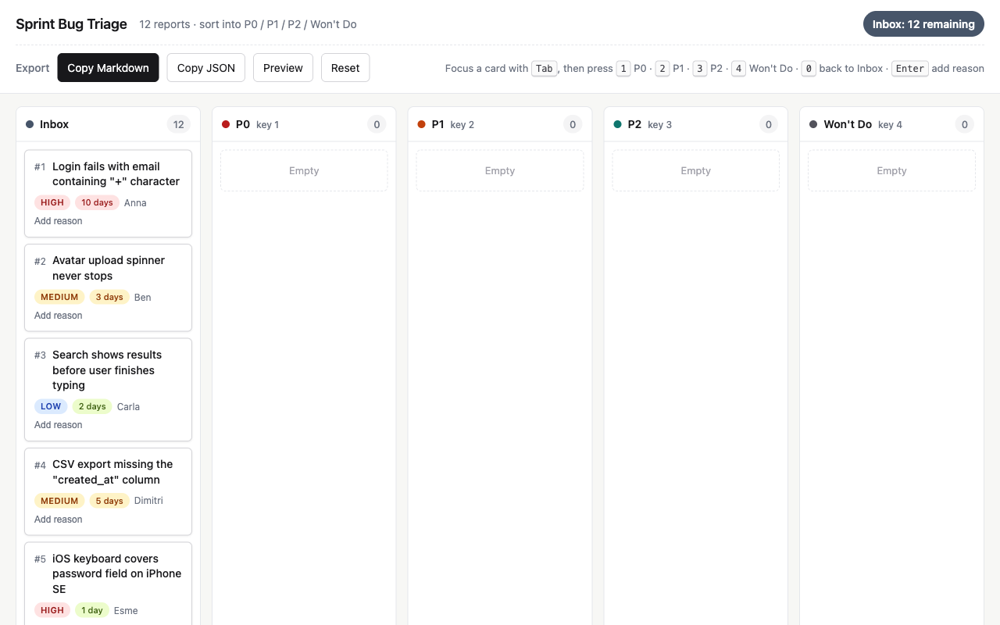
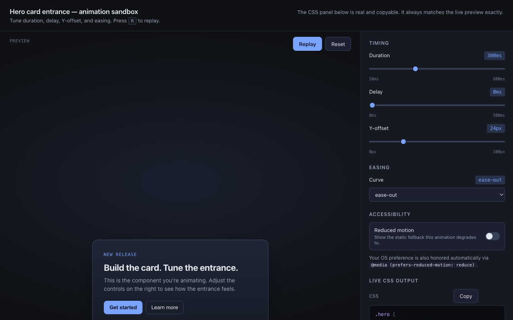
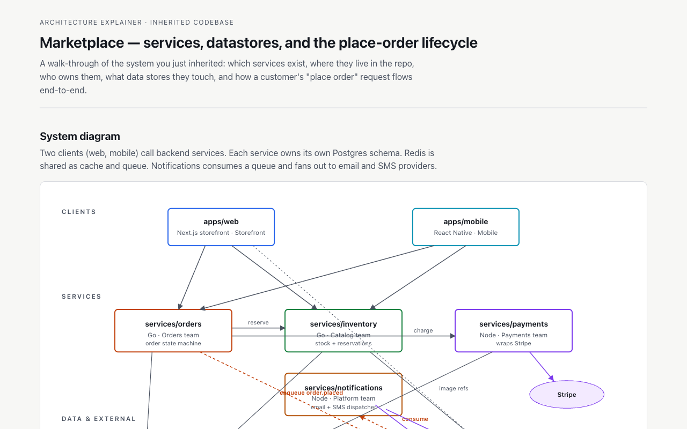
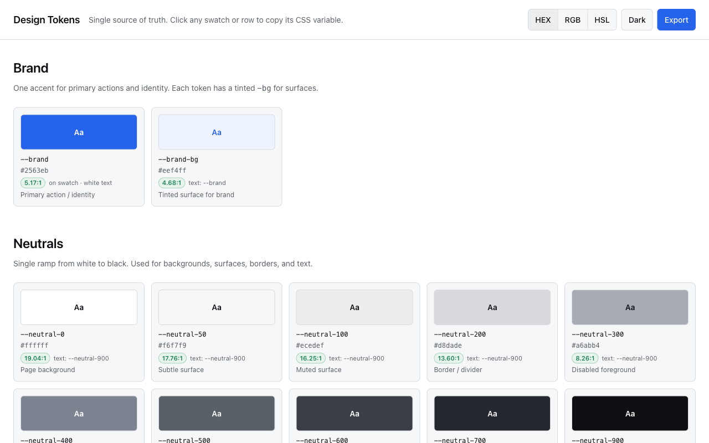

# html-workbench

> An agent-agnostic skill that produces self-contained HTML artifacts — plans, specs, code reviews, explainers, design explorations, prototypes, reports, slide decks, and one-off editing interfaces — when HTML genuinely beats Markdown for the task.

<table>
  <tr>
    <td width="50%"><a href="https://rnnh-code.github.io/html-workbench/triage-board.html"></a><br><sub><em><b>Triage board.</b> Drag-drop or keyboard (1/2/3/4) to assign. Export to JSON or Markdown.</em></sub></td>
    <td width="50%"><a href="https://rnnh-code.github.io/html-workbench/animation-sandbox.html"></a><br><sub><em><b>Animation sandbox.</b> Sliders for duration, delay, offset, easing. Live preview, copyable CSS.</em></sub></td>
  </tr>
  <tr>
    <td width="50%"><a href="https://rnnh-code.github.io/html-workbench/architecture-map.html"></a><br><sub><em><b>Architecture map.</b> SVG diagram with consistent shape language plus a filterable module table.</em></sub></td>
    <td width="50%"><a href="https://rnnh-code.github.io/html-workbench/design-tokens.html"></a><br><sub><em><b>Design tokens.</b> Click-to-copy CSS variables, real contrast ratios, light + dark.</em></sub></td>
  </tr>
</table>

**[→ See all 7 live examples](https://rnnh-code.github.io/html-workbench/)**

## What it does

`html-workbench` teaches an AI agent two things: **when** an HTML artifact will materially improve a response over plain Markdown, and **how** to build a polished, self-contained `.html` file that earns its weight.

Every artifact is a single `.html` file with inline CSS and JavaScript — no React, no Tailwind, no shadcn/ui, no CDN scripts, no npm. Open it directly in a browser. Share it as a file. Fork it. Edit it.

### Twenty pattern templates

The skill ships detailed templates for:

- **Documents** — implementation plans, technical specs, RFCs
- **Code review** — annotated diffs, severity-tagged concerns, reviewer checklists
- **Explainers** — architecture maps, request lifecycles, technical walkthroughs
- **Reports** — weekly status reports, incident postmortems
- **Design surfaces** — token sheets, component variant matrices, design explorations
- **Prototypes** — clickable flows, animation sandboxes, slide decks
- **Editors** — triage boards, prompt tuners, feature-flag editors, dataset curation tools, decision matrices, SVG diagram sheets

Each template defines required sections, useful interactions, the export mechanism, and the common mistakes to avoid.

### Eight-category capability taxonomy

The skill triggers on tasks that meaningfully use **two or more** of:

| | | |
|---|---|---|
| 1. Tables | 2. Design | 3. Illustrations |
| 4. Code | 5. Interaction | 6. Workflows |
| 7. Spatial layouts | 8. Images | |

If only one applies weakly — a five-line code answer, a three-row comparison, a quick definition — the skill explicitly declines and produces Markdown instead.

### What makes it more than "ask Claude to make an HTML file"

- **Trigger calibration.** Built-in anti-triggers (short answers, simple lists, code-only responses, explicit Markdown requests) so the skill doesn't over-fire on tasks where Markdown is genuinely clearer.
- **Quality floor.** Accessibility (WCAG AA contrast, keyboard nav, semantic HTML), responsive layout, framework neutrality, color discipline, restraint on motion. Documented in a checklist the agent walks through before finalizing the artifact.
- **Export loop.** Any artifact that captures user decisions (sort, edit, tune, annotate) ships with copy/download buttons that turn the user's interaction back into Markdown, JSON, or pasteable agent input. Vanilla JS snippets included.
- **Pattern selection heuristic.** Disambiguates documents vs. reports vs. dashboards vs. prototypes vs. editors vs. slide decks vs. diagram sheets — so a "review my PR" request and a "show me design directions" request produce structurally different (and appropriate) artifacts.

## When to use

| Reach for HTML when... | Stay in Markdown when... |
|---|---|
| Comparing options across multiple axes | Answer is < 200 words of prose |
| Explaining code with diffs and diagrams | Single command or code snippet |
| Reviewing a PR | Quick definition or yes/no |
| Planning multi-step implementation | 3-5 row comparison table |
| Tuning behavior with sliders/toggles | The user explicitly asked for Markdown |
| Triaging or reordering things to export | Pure code answer where the file *is* the deliverable |
| Presenting to others (slide-like) | Tasks where HTML would be decorative, not load-bearing |
| Reporting status with metric deltas | |
| Explaining an incident with a timeline | |
| Showing design (tokens, components, states) | |
| Editing structured data with validation | |

## Install

### Claude Code

```bash
git clone https://github.com/rnnh-code/html-workbench ~/.claude/skills/html-workbench
```

The skill is auto-discovered. Restart Claude Code if it's running, then ask for any of the artifact types above.

### Other agents

The skill is plain Markdown plus one JSON file — agent-agnostic by design. If your platform supports skills with YAML frontmatter, drop the directory in. If not, point your agent at `SKILL.md` directly.

You can also download the `.skill` archive from the [latest release](https://github.com/rnnh-code/html-workbench/releases) — it's a zip you can extract into your agent's skills directory.

## Repo structure

```
html-workbench/
├── SKILL.md                                  # 16-section agent-facing prompt (entry point)
├── references/
│   ├── html_artifact_patterns.md             # 20 detailed templates
│   ├── ui_ux_quality_floor.md                # accessibility / contrast / responsive checklist
│   ├── decision_heuristics.md                # Markdown vs. HTML disambiguation
│   ├── design_direction.md                   # per-style aesthetic guidance
│   ├── color_strategy.md                     # tokens, palettes, contrast, metric direction
│   ├── purposeful_delight.md                 # when to animate, when not to
│   ├── export_patterns.md                    # vanilla JS clipboard / download snippets
│   ├── reusable_html_primitives.md           # cards, badges, tabs, callouts as plain HTML/CSS/JS
│   └── optional_media_handling.md            # screenshots, frame sheets, SVG placeholders
├── examples/                                  # 8 worked example prompts
└── evals/evals.json                           # 18-prompt benchmark (14 positive + 4 negative)
```

## Eval results

The bundled eval set has 18 prompts covering the full pattern range plus four explicit negatives (a definitional question, a code-only request, a tiny comparison table, and an "I want Markdown" request). In the initial benchmark, the skill correctly triggered on all 14 positives and correctly declined on all 4 negatives, with every produced artifact passing structural assertions (semantic HTML, AA contrast, no remote scripts, expected pattern markers, working export buttons).

## Credit & inspiration

The eight-category taxonomy and the export-loop discipline are adapted from [Thariq's *HTML Effectiveness*](https://thariqs.github.io/html-effectiveness/) essay ([@trq212](https://x.com/trq212)) — read it if you haven't. This skill operationalizes that framework with explicit triggers, anti-triggers, pattern templates, and a UI/UX quality floor. The skill structure follows [Anthropic's skill-creator](https://github.com/anthropics/skills/tree/main/skills/skill-creator) progressive-disclosure pattern.

## Contributing

Issues, pull requests, and forks are welcome. If you spot a missing pattern, an over-trigger or under-trigger case, a clearer phrasing for the trigger description, or a better worked example, open a PR.

## License

MIT — see [LICENSE](./LICENSE).
